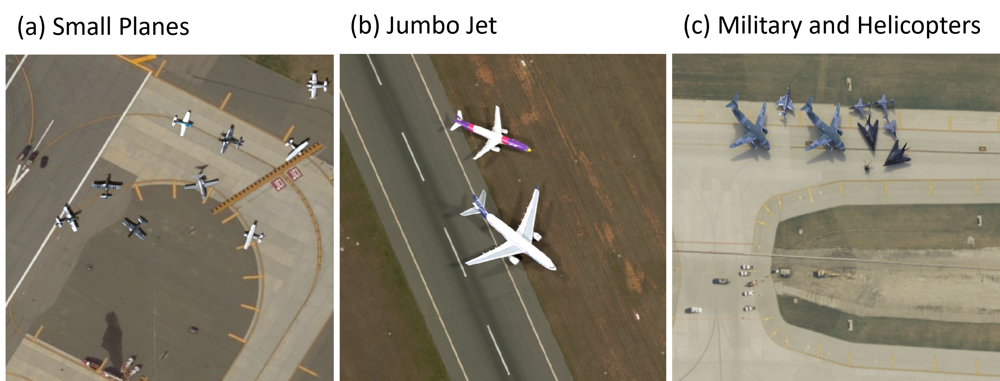

# OnlyPlanes: Incrementally Tuning Synthetic Training Datasets for Satellite Object Detection
Project Links:  [[Paper][paper_link]] [[Project Page][project_page]] [[Video][youtube_vid]] [[Blog][medium_blog_series]]


[paper_link]: docs/OnlyPlanes_report_placeholder.pdf
[project_page]: https://naivelogic.github.io/OnlyPlanes/
[medium_blog_series]: TBD
[youtube_vid]: TBD

## Dataset Overview
OnlyPlanes is a relatively smaller synthetic dataset (less than 50k images and less than 20GB in weight) developed by Microsoft Synthetics for airplane object and instant segmentation computer vision task from satellite imagery.

| Dataset           | Size     | Description |
|-------------------|----------|-------------|
| Train 0 Dataset   | 551.4 MB | Training    |
| Train 1 Dataset   | 531.8 MB | Training    |
| Train 2 Dataset   | 536.4 MB | Training    |
| Train 3 Dataset   | 513.0 MB | Training    |
| Train 4 Dataset   | 509.9 MB | Training    |
| Train 5 Dataset   | 7.1 GB   | Training    |
| Train 6 Dataset   | 5.3 GB   | Training    |
| Evaluation Datset | TBD      | Evaluation  |

<details>
 <summary>Dataset Description</summary>
The OnlyPlanes dataset contains 12,500 images and 132,967 instance objects consisting of four categories (plane, jumbo jet, military, helicopter) with 80 fine-grain attributes that define the plane model (e.g., Boeing 737). A single training dataset is provided for both object detection and instance segmentation tasks at 1024x1024 image resolution using ten different airport. 


</details>


----
## Citation

If you find this project useful or utilize the OnlyPlanes Dataset for your research, please kindly cite our paper.

```bibtex
@article{hale2022OnlyPlanes,
  title={OnlyPlanes: Incrementally Tuning Synthetic Training Datasets for Satellite Object Detection},
  author={Hale, Phillip and Tiday, Luke and Urbina, Pedro},
  number={arXiv:TBD},
  year={2022}
}
```