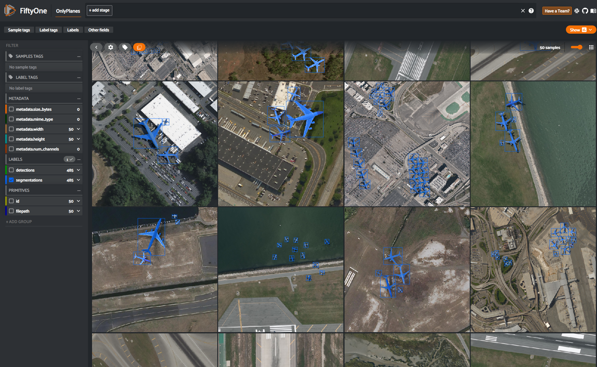

# FiftyOne Usage

[FiftyOne](https://voxel51.com/docs/fiftyone/index.html) is a great tool when working with computer vision datasets and understanding areas to improve a model. Here we utilize fifityone to (1) visualize datasets and (2) interpret models results, which is a primary activity in the _Synthetic Learning Feedback Loop_ introduced in the OnlyPlanes paper. 

## Visualizing Datasets

To visualize datasets run the following command, which can also be executed by updating the arguments in the `fifty1_dataset_view.sh` script. 

```sh
DATASET_NAME=name_of_dataset                #(e.g., OnlyPlanes)
DS_IMG_DIR=/path/to/image/directory         #(e.g., datasets/OnlyPlanes/images)
DS_LABEL_DIR=/path/to/coco_annotations.json #(e.g., datasets/OnlyPlanes/coco_ds/OnlyPlanes_binary_plane_annotations.json)

python fifty1_dataset_view.py --dataset_name ${DATASET_NAME} \
                              --data_path ${DS_IMG_DIR} --label_path ${DS_LABEL_DIR} \
                              --max_samples 50 --segm_labels --shuffle True
```

Below is an sample of OnlyPlanes dataset visualized in fiftyone with segmentation labels. 




## Visualizing Model Detection Results 

A key activity in the _Synthetic Learning Feedback Loop_ introduced in the OnlyPlanes paper is understanding where the model should be improved by identifying common miss detection scenarios. To perform this, first you need to run the model on a test dataset where the inference/prediction reuslts are stored in the [common coco evaluation detection format](https://cocodataset.org/#detection-eval). To visualize the predicted detections by the model on the dataset run the following command, which can also be executed by updating the arguments in the `fifty1_dataset_view_evals.sh` script. 

```sh
DATASET_NAME=name_of_dataset                #(e.g., rareplanesTest)
DS_IMG_DIR=/path/to/image/directory         #(e.g., rareplanes/test/PS-RGB_tiled)
DS_LABEL_DIR=/path/to/coco_annotations.json #(e.g., rareplanes/test/aircraft_real_test_coco.json)
EVAL_LIST1=common_model_name,path/to/coco_instances_results.json
EVAL_LIST2=common_model_name,path/to/coco_instances_results.json

python fifty1_dataset_view.py --dataset_name ${DATASET_NAME} \
                              --data_path ${DS_IMG_DIR} --label_path ${DS_LABEL_DIR} \
                              --max_samples 50 --shuffle True \
                              --eval_list ${EVAL_LIST1} ${EVAL_LIST2}

```